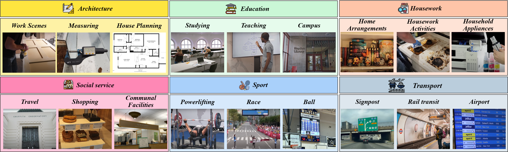
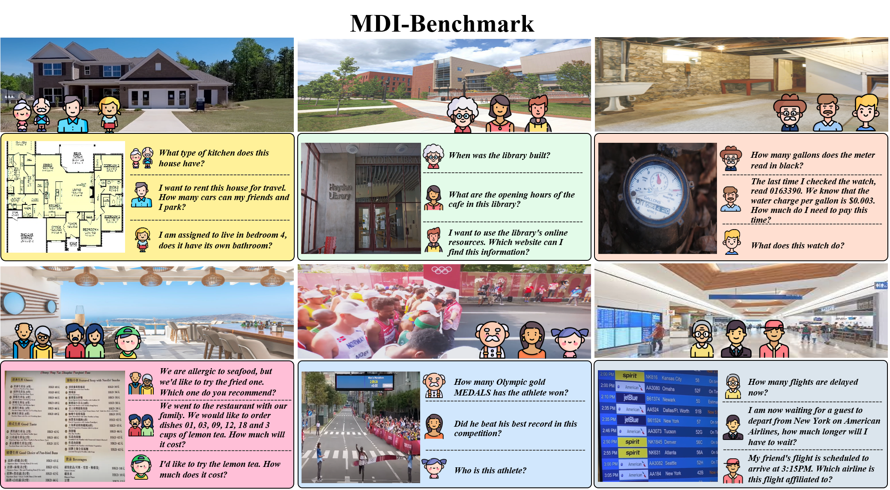
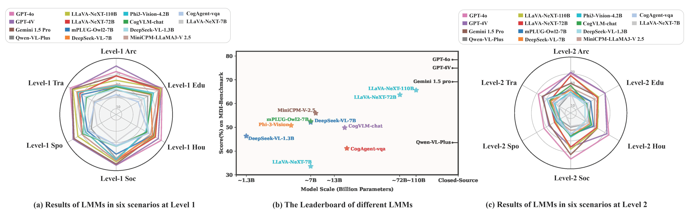
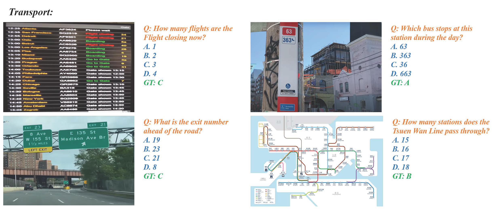
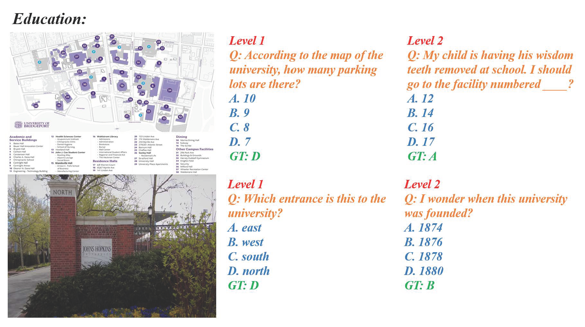
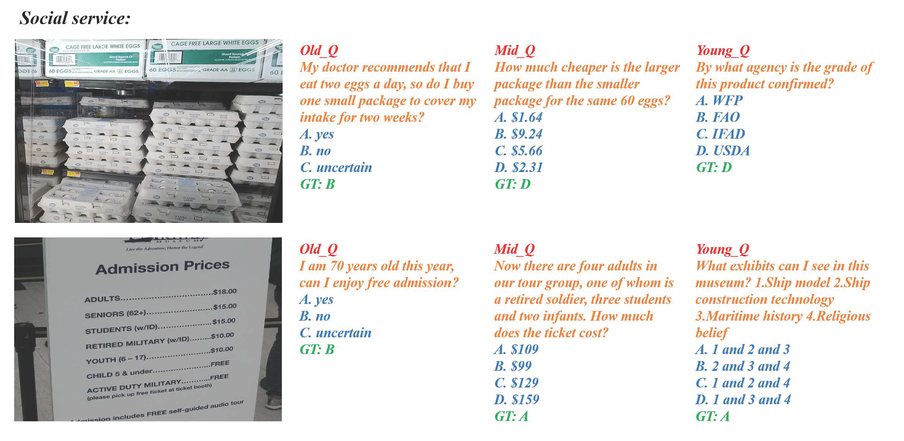

# Multi-Dimensional Insights:  Benchmarking Real-World Personalization in Large Multimodal Models


 

<p align="center">
     <br>
</p>

## Outlines
- [💥 News 💥](README.md#-news-)
- [👀 About MDI-Benchmark]()
- [🏆 Leaderboard on MDI-Benchmark 🏆](https://github.com/MDI-Benchmark/MDI-Benchmark/blob/main/README.md#-leaderboard-on-MDI-Benchmark-)
- [📝 Evaluation Piplines on MDI-Benchmark](https://github.com/MDI-Benchmark/MDI-Benchmark/blob/main/README.md#-evaluation-piplines-on-MDI-Benchmark)
- [📊 MDI-Benchmark Dataset](https://github.com/MDI-Benchmark/MDI-Benchmark/blob/main/README.md#-MDI-Benchmark-dataset)
- [📜 License](https://github.com/MDI-Benchmark/MDI-Benchmark/blob/main/README.md#-license)
- [🤝 Contributors](https://github.com/MDI-Benchmark/MDI-Benchmark/blob/main/README.md#-contributors)

## 💥 News 💥
  **[2023.10.8]** Our paper is now accessible at .

  **[2024.10.8]** Our project homepage can be accessed at https://MDI-Benchmark.github.io/.

## 👀 About MDI-Benchmark
To align with the <b>actual needs of humans</b> for Large Multimodal Models, we propose a multi-modal benchmark for providing a thorough assessment of the capacities of LMMs in practical, real-world scenarios.

<p align="center">
     <br>
    The overview of the <b>MDI-Benchmark</b> six real-world multimodal scenarios.
</p>

The MDI-Benchmark includes over <b>500 real-world images</b> and <b>1.2k human-posed questions</b>, spanning six real-world multimodal scenarios. Each scenario is divided into 3 sub-domains with 2 levels of complexity. Additionally, we incorporate age factors into the evaluation to guide LMMs in personalizing their responses for different demographic groups.

<p align="center">
     <br>
    The <b>MDI-Benchmark</b> includes real needs of different age groups in six major real-world scenarios.
</p>

With the MDI-Benchmark, we conduct a comprehensive evaluation of several mainstream LMMs. Specifically, GPT-4o achieved the best results across all indicators, but there is still significant room for improvement in addressing the needs of different age groups. Further analysis across dimensions such as Scenario, Complexity and Age provides valuable insights for developing reliable, personalized human assistants.

<p align="center">
     <br>
    Performance of the model at <b>different difficulty levels</b> and the overall performance results of the model under the score metric.
</p>

We hope our research will advance the application of multimodal large models in real-world scenarios and pave the way for the development of <b>multi-dimensional personalization</b>.


## 🏆 Leaderboard on MDI-Benchmark 🏆
🚨🚨 The [Leaderboard](https://MDI-Benchmark.github.io/#leaderboard) is continuously being updated. We welcome the results of your model!
To submit your results to the leaderboard on the **testmini** subset, please send to [this email](mailto:zhangyifan_ai@bupt.edu.cn) with your result JSON file and score CSV file.

## 📝 Evaluation Piplines on MDI-Benchmark

### Response Generation 
The models generate responses based on the given questions and images. Examples for generating responses from some LMMs are provided in the [evaluation](./evaluation). Our prompt specifies the format of answer generation to facilitate subsequent extraction of the answer using string matching. Please refer to the following template to prepare your result JSON files for subsequent evaluation.
```json
{
        "question number": 1,
        "split": "testmini",
        "key": "level1-architecture-old",
        "image_path": "architecture/houseplaning_0",
        "question": "Looking at this house plan, how many bedrooms does this house have?",
        "option": "A.1; B.2; C.3; D.4",
        "answer": "C",
        "response": "<Thought process>: ... <Answer>: ..."
}


```
### Score Calculation
Due to the multiple-choice question format of our dataset and the specific answer generation prompt, we use string matching to directly extract answers, which eliminates the high cost of using additional models for further answer extraction.  The extracted answer is normalized to an option letter and calculate scores on our proposed four-dimensional metrics in [four_dimensional_metrics.py](https://github.com/MDI-Benchmark/MDI-Benchmark/blob/main/evaluation/four_dimensional_metrics.py).
```sh
cd evaluation

python four_dimensional_metrics_refine.py \
--model_name GPT-4o \
--output_json ../output/GPT-4o.json  \
--main_results_csv_path ../result/four_dimensional_metrics.csv
```

Performences on One-Step / Two-Step / Three-Step problems and different problem domains are obtained from [accuracy.py](https://github.com/MDI-Benchmark/MDI-Benchmark/blob/main/evaluation/accuracy.py).

```sh
cd evaluation

python accuracy.py \
--model_name GPT-4o \
--output_json ../output/GPT-4o.json  \
--knowledge_structure_nodes_path /data/knowledge_structure_nodes.json \
```


## 📊 MDI-Benchmark Dataset

### Metric for Reasoning Evaluation
To better assess the capabilities demonstrated by the model, we defined the scoring metric:

$$
\text{Score}_\text{final} = \alpha \cdot \text{Score}_\text{L1} + (1 - \alpha) \cdot \text{Score}_\text{L2}
$$

where 
$$
\text{Score}_\text{L1}, \text{Score}_\text{L2}
$$
denotes the average performance of LMMs in various fields at the first and second tiers, respectively and we set the default value of 
$$
\alpha = 0.5
$$

### Exmaples
<details>
<summary>🔍Examples of question samples.</summary>
<p align="center">
     <br>
    Examples of Transport Scenario.
</p>


<p align="center">
	 <br>
	Examples of Education Scenario Level Questions.
</p>

<p align="center">
	 <br>
	Example of Social Service Scenario Age Questions.
</p>

</details>


## 📜 License

Our dataset are distributed under the [CC BY-NC 4.0](https://creativecommons.org/licenses/by-nc/4.0/) license.


## :white_check_mark: Cite

If you find **MDI-Benchmark** useful for your your research and applications, please kindly cite using this BibTeX:

```bibtex
@misc{ 
}
```


## 🤝 Contributors
Here are the key contributors to this project:

Yifan Zhang, Shanglin Lei, Runqi Qiao, Zhuoma GongQue, Xiaoshuai Song, Guanting Dong, Qiuna Tan, Zhe Wei, Peiqing Yang, Ye Tian, Xiaofei Wang, Honggang Zhang
